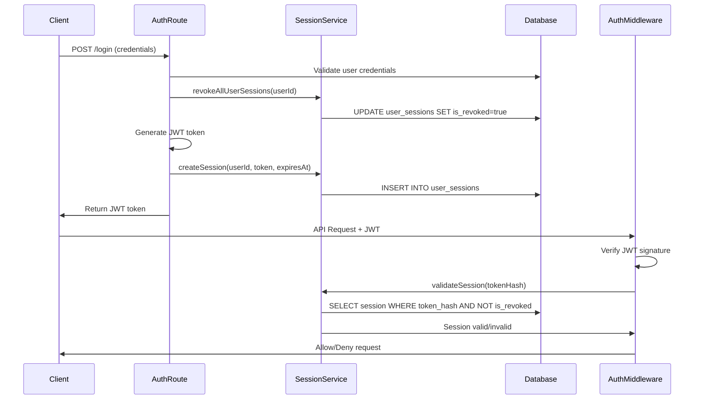

# Design Document: Single Device Session Management

## Overview

This design implements single-device session management for the educational book subscription system. The solution tracks user sessions in the database and enforces a single active session per user by revoking previous sessions when a new login occurs. The implementation integrates with the existing JWT-based authentication system while adding database-backed session validation.

The design follows a layered approach:
1. Session service layer for session CRUD operations
2. Enhanced authentication middleware for session validation
3. Modified login/logout flows to manage sessions
4. Token refresh flow updates for session continuity

## Architecture

### High-Level Flow

```
User Login Request
    ↓
Validate Credentials
    ↓
Revoke All Existing Sessions (user_id)
    ↓
Generate JWT Token
    ↓
Create New Session Record (token_hash, expires_at)
    ↓
Return JWT Token to Client
    
---

API Request with JWT
    ↓
Validate JWT Signature & Expiration
    ↓
Look up Session by Token Hash
    ↓
Check: is_revoked = false AND expires_at > now()
    ↓
Allow/Deny Request
```

### Component Interaction



## Components and Interfaces

### 1. Session Service (`src/services/sessionService.js`)

Handles all session-related database operations.

```javascript
class SessionService {
  /**
   * Create a new session record
   * @param {string} userId - User UUID
   * @param {string} token - JWT token (will be hashed)
   * @param {Date} expiresAt - Session expiration timestamp
   * @returns {Promise<Object>} Created session object
   */
  async createSession(userId, token, expiresAt)
  
  /**
   * Revoke all active sessions for a user
   * @param {string} userId - User UUID
   * @returns {Promise<number>} Number of sessions revoked
   */
  async revokeAllUserSessions(userId)
  
  /**
   * Revoke a specific session by token
   * @param {string} token - JWT token
   * @returns {Promise<boolean>} True if session was revoked
   */
  async revokeSession(token)
  
  /**
   * Validate if a session is active
   * @param {string} token - JWT token
   * @returns {Promise<Object|null>} Session object if valid, null otherwise
   */
  async validateSession(token)
  
  /**
   * Update session with new token (for refresh)
   * @param {string} oldToken - Current JWT token
   * @param {string} newToken - New JWT token
   * @param {Date} newExpiresAt - New expiration timestamp
   * @returns {Promise<Object>} Updated session object
   */
  async updateSession(oldToken, newToken, newExpiresAt)
  
  /**
   * Hash a JWT token for storage
   * @param {string} token - JWT token
   * @returns {string} SHA-256 hash of token
   */
  hashToken(token)
}
```

### 2. Enhanced Authentication Middleware (`src/middleware/auth.js`)

Modified to include session validation after JWT verification.

```javascript
/**
 * Enhanced authentication middleware with session validation
 * @param {Object} req - Express request
 * @param {Object} res - Express response
 * @param {Function} next - Express next function
 */
async function authenticateToken(req, res, next) {
  // 1. Extract token from Authorization header
  // 2. Verify JWT signature and expiration
  // 3. Validate session in database (not revoked, not expired)
  // 4. Attach user info to req.user
  // 5. Call next() or return error
}
```

### 3. Modified Auth Routes (`src/routes/auth.js`)

Updated login, logout, and refresh endpoints to manage sessions.

```javascript
// POST /auth/login
async function login(req, res) {
  // 1. Validate credentials
  // 2. Revoke all existing user sessions
  // 3. Generate JWT token
  // 4. Create new session record
  // 5. Return token to client
}

// POST /auth/logout
async function logout(req, res) {
  // 1. Extract token from request
  // 2. Revoke session in database
  // 3. Return success response
}

// POST /auth/refresh
async function refresh(req, res) {
  // 1. Validate current session
  // 2. Generate new JWT token
  // 3. Update session record with new token
  // 4. Return new token
}
```

## Data Models

### UserSession Model (Existing - Enhanced)

The existing `UserSession` model will be used with the following structure:

```javascript
{
  id: UUID (primary key),
  user_id: UUID (foreign key to users),
  token_hash: STRING(255) (SHA-256 hash of JWT),
  expires_at: DATE (matches JWT expiration),
  is_revoked: BOOLEAN (default false),
  created_at: TIMESTAMP
}
```

**Key Fields:**
- `token_hash`: SHA-256 hash of the JWT token for secure storage and lookup
- `expires_at`: Timestamp when the session expires (matches JWT exp claim)
- `is_revoked`: Flag to mark session as invalid (set to true on logout or new login)
- `user_id`: Links session to user for bulk revocation

**Indexes:**
- `idx_user_sessions_user_id`: Fast lookup of all user sessions
- `idx_user_sessions_token_hash`: Fast validation of specific session
- `idx_user_sessions_expires_at`: Efficient cleanup of expired sessions

## Correctness Properties

*A property is a characteristic or behavior that should hold true across all valid executions of a system—essentially, a formal statement about what the system should do. Properties serve as the bridge between human-readable specifications and machine-verifiable correctness guarantees.*

### Property 1: Single Active Session Invariant

*For any* user, after a successful login, there should be exactly one active (non-revoked, non-expired) session in the database for that user.

**Validates: Requirements 1.1, 1.2, 1.3, 1.4**

### Property 2: Session Revocation Completeness

*For any* user with N existing active sessions, when that user logs in, all N sessions should be marked as revoked before the new session is created.

**Validates: Requirements 1.1, 1.2, 1.3**

### Property 3: Token-Session Correspondence

*For any* valid JWT token returned by the login endpoint, there should exist exactly one corresponding session record in the database with matching token_hash and is_revoked=false.

**Validates: Requirements 2.1, 2.2, 2.5**

### Property 4: Session Validation Rejection

*For any* API request with a JWT token whose corresponding session is revoked or expired, the system should reject the request with a 401 status code.

**Validates: Requirements 3.2, 3.3, 5.4**

### Property 5: Logout Session Revocation

*For any* authenticated user who calls the logout endpoint, their current session should be marked as is_revoked=true in the database.

**Validates: Requirements 5.1, 5.2**

### Property 6: Session Expiration Consistency

*For any* session record created during login, the expires_at timestamp should match the exp claim in the corresponding JWT token.

**Validates: Requirements 2.3, 6.1, 6.2**

### Property 7: Token Refresh Session Continuity

*For any* successful token refresh operation, the session ID should remain unchanged while the token_hash and expires_at are updated to reflect the new token.

**Validates: Requirements 8.2, 8.4**

### Property 8: Revoked Session Rejection

*For any* session marked as is_revoked=true, all subsequent API requests using that session's token should be rejected regardless of the JWT's validity.

**Validates: Requirements 3.2, 5.4, 8.3**

## Error Handling

### Error Codes and Responses

| Error Code | HTTP Status | Description | When It Occurs |
|------------|-------------|-------------|----------------|
| SESSION_REVOKED | 401 | Session has been revoked | User logged in from another device |
| SESSION_EXPIRED | 401 | Session has expired | Session expires_at < current time |
| SESSION_NOT_FOUND | 401 | No session record found | Token not in database |
| SESSION_CREATION_FAILED | 500 | Failed to create session | Database error during login |
| SESSION_VALIDATION_FAILED | 500 | Session validation error | Database error during validation |

### Error Response Format

```javascript
{
  success: false,
  message: "Human-readable error message",
  error: "ERROR_CODE"
}
```

### Error Handling Strategy

1. **Database Errors**: Log detailed error, return generic 500 response
2. **Session Not Found**: Return 401 with SESSION_NOT_FOUND code
3. **Revoked Session**: Return 401 with SESSION_REVOKED code
4. **Expired Session**: Return 401 with SESSION_EXPIRED code
5. **Concurrent Login**: Allow new login to succeed, old sessions revoked

### Logging

All session-related errors should be logged with:
- User ID (if available)
- Token hash (first 8 characters only)
- Error type and message
- Timestamp
- Request IP address

## Testing Strategy

### Unit Tests

Unit tests will verify specific examples and edge cases:

1. **Session Service Tests**
   - Creating a session with valid data
   - Revoking all sessions for a user with multiple active sessions
   - Revoking a specific session by token
   - Validating an active session
   - Rejecting a revoked session
   - Rejecting an expired session
   - Updating a session during token refresh
   - Token hashing produces consistent results

2. **Authentication Middleware Tests**
   - Valid JWT with active session allows request
   - Valid JWT with revoked session denies request
   - Valid JWT with expired session denies request
   - Valid JWT with no session record denies request
   - Invalid JWT denies request
   - Missing token denies request

3. **Auth Route Tests**
   - Login revokes existing sessions before creating new one
   - Login creates exactly one new session
   - Logout marks session as revoked
   - Token refresh updates session record
   - Token refresh fails with revoked session

### Property-Based Tests

Property-based tests will verify universal correctness properties across randomized inputs. Each test will run a minimum of 100 iterations.

**Testing Framework**: We'll use `fast-check` for JavaScript property-based testing.

**Test Configuration**:
```javascript
fc.assert(
  fc.property(/* generators */, /* test function */),
  { numRuns: 100 }
);
```

**Property Test Cases**:

1. **Property 1: Single Active Session Invariant**
   - Generate: Random user ID, random number of existing sessions
   - Action: Perform login
   - Assert: Exactly one active session exists for user

2. **Property 2: Session Revocation Completeness**
   - Generate: Random user ID, random array of active sessions
   - Action: Revoke all sessions
   - Assert: All sessions have is_revoked=true

3. **Property 3: Token-Session Correspondence**
   - Generate: Random user credentials
   - Action: Login and get token
   - Assert: Session exists with matching token_hash

4. **Property 4: Session Validation Rejection**
   - Generate: Random revoked/expired session
   - Action: Attempt API request
   - Assert: Request rejected with 401

5. **Property 5: Logout Session Revocation**
   - Generate: Random active session
   - Action: Call logout
   - Assert: Session is_revoked=true

6. **Property 6: Session Expiration Consistency**
   - Generate: Random JWT expiration time
   - Action: Create session
   - Assert: expires_at matches JWT exp claim

7. **Property 7: Token Refresh Session Continuity**
   - Generate: Random active session
   - Action: Refresh token
   - Assert: Same session ID, updated token_hash and expires_at

8. **Property 8: Revoked Session Rejection**
   - Generate: Random revoked session token
   - Action: Attempt API request
   - Assert: Request rejected regardless of JWT validity

### Integration Tests

Integration tests will verify end-to-end flows:

1. **Login from Multiple Devices**
   - Login from device A
   - Login from device B
   - Verify device A token is rejected
   - Verify device B token works

2. **Logout and Token Reuse**
   - Login and get token
   - Logout
   - Attempt API request with old token
   - Verify request is rejected

3. **Token Refresh Flow**
   - Login and get token
   - Refresh token
   - Verify old token is rejected
   - Verify new token works

4. **Concurrent Login Handling**
   - Simulate multiple simultaneous logins
   - Verify only the last login's session is active

### Test Data Generators

For property-based tests, we'll need generators for:

```javascript
// Generate random user ID
const userIdGen = fc.uuid();

// Generate random JWT token
const jwtTokenGen = fc.string({ minLength: 100, maxLength: 200 });

// Generate random session data
const sessionGen = fc.record({
  userId: fc.uuid(),
  tokenHash: fc.string({ minLength: 64, maxLength: 64 }), // SHA-256 hash
  expiresAt: fc.date({ min: new Date(), max: new Date(Date.now() + 7 * 24 * 60 * 60 * 1000) }),
  isRevoked: fc.boolean()
});

// Generate expired session
const expiredSessionGen = fc.record({
  userId: fc.uuid(),
  tokenHash: fc.string({ minLength: 64, maxLength: 64 }),
  expiresAt: fc.date({ max: new Date(Date.now() - 1000) }), // Past date
  isRevoked: fc.boolean()
});
```

## Implementation Notes

### Token Hashing

Use Node.js crypto module for SHA-256 hashing:

```javascript
const crypto = require('crypto');

function hashToken(token) {
  return crypto.createHash('sha256').update(token).digest('hex');
}
```

### Performance Considerations

1. **Database Indexes**: Ensure `token_hash` and `user_id` are indexed
2. **Session Lookup**: Single query by token_hash for validation
3. **Bulk Revocation**: Single UPDATE query for revoking all user sessions
4. **Connection Pooling**: Use existing Sequelize connection pool

### Security Considerations

1. **Token Storage**: Never store raw JWT tokens, only SHA-256 hashes
2. **Error Messages**: Don't expose session IDs or sensitive data in errors
3. **Timing Attacks**: Use constant-time comparison for token hashes
4. **Rate Limiting**: Consider adding rate limiting to login endpoint
5. **Audit Logging**: Log all session revocations for security monitoring

### Migration Strategy

1. **Phase 1**: Deploy session service and models (no enforcement)
2. **Phase 2**: Update login to create sessions (backward compatible)
3. **Phase 3**: Enable session validation in middleware
4. **Phase 4**: Monitor and adjust based on production metrics

### Backward Compatibility

- Existing JWT tokens will continue to work until they expire
- New logins will create session records
- Gradual rollout ensures no service disruption
- Old tokens without sessions can be handled gracefully with a grace period
